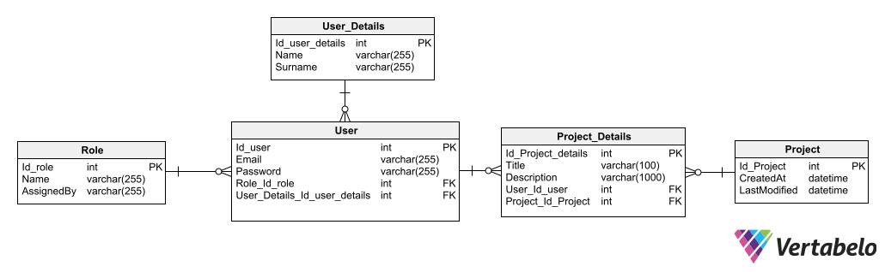

# Project Manager

## Project Overview

The application named "Project Manager" is designed to facilitate the management of projects and tasks. Users can easily create, edit, and delete their projects. Additionally, users have the option to create shared projects.

## Features

- **Full CRUD Operations:** Users can create, read, update, and delete projects.
- **List Display:** Display lists of all records for each table.
- **Detailed Views:** Show detailed views of individual projects.
- **Data Validation:** Client-side and server-side data validation.
- **User Registration and Login:** Enable user registration and login functionality.
- **Authentication and Authorization:** Implement user authentication and authorization using JWT Token.
- **Pagination:** Paginate displayed lists for better usability.
- **Shared Projects:** Allow projects to be shared between users.

## Database Model



## Technologies

### Backend:
- .NET Entity Framework Core

### Frontend:
- React.js

### DB-Engine:
- MySQL

## Scripts

### To build the frontend application, use the npm package manager:
```bash
npm install
npm start
```
Since the database was created using the code-first approach, several actions are required.
To migrate the database, specify the appropriate connection string in the appsettings.json file, e.g.:
```js
"ConnectionStrings": {
    "Default": "Server=(localdb)\\mssqllocaldb;Database=MangeITdb;Trusted_Connection=True;"
}
```
Then, in the NuGet Package Manager, enter the command (RECOMMENDED):
```bash
update-database
```
Or using a standard cmd (might not work):
```bash
dotnet ef database update
```
If the result is positive, tables and sample data should be added automatically, as the program has an implemented seeder with example data.
